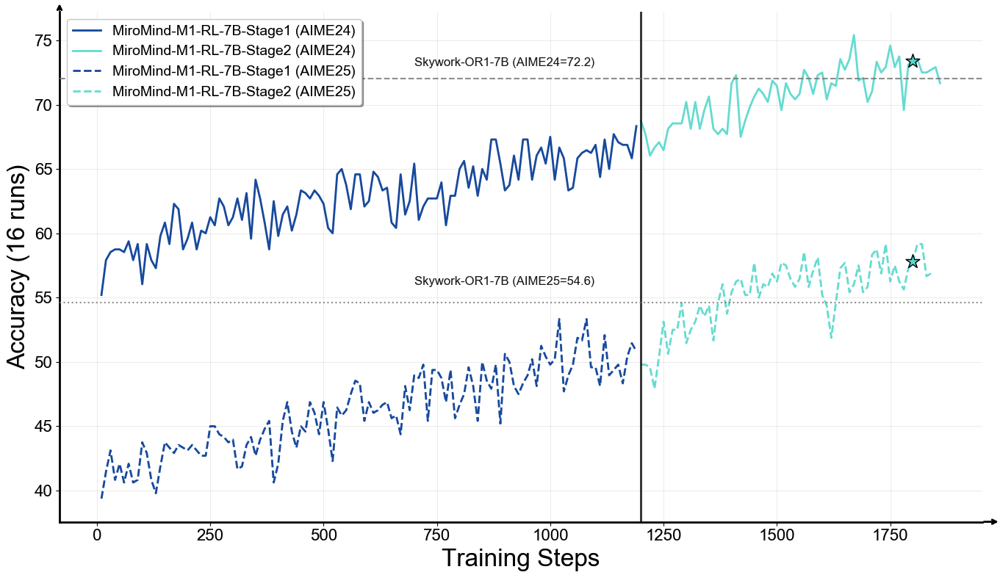

<!-- markdownlint-disable first-line-h1 -->
<!-- markdownlint-disable html -->
<!-- markdownlint-disable no-duplicate-header -->

<div align="center">
  
</div>
<!-- <hr> -->
<div align="center">

[](https://huggingface.co/collections/Skywork/skywork-or1-67fa1bcb41b436ef2def76b9)
[](https://huggingface.co/datasets/Skywork/Skywork-OR1-RL-Data)
[](https://github.com/XYaoooo/MiroMind-M1)
[](https://miromind.ai/)

</div>


# MiroMind-M1


## Overview
<div align="center">
  
  <p><i>Training performance of MiroMind-M1-RL-7B on AIME24 and AIME25.</i></p>
</div>

[One paragraph to introduce both MiroMind-M1 model series.]


## Evaluation

## Getting Started

### Installation

venv environment:

```bash
git clone https://github.com/XYaoooo/MiroMind-M1.git
cd MiroMind-M1

# Install Python 3.10 environment.
python3.10 -m pip install virtualenv
virtualenv -p python3.10 venv
source venv/bin/activate

# Install dependencies.
pip3 install torch==2.4.0 --index-url https://download.pytorch.org/whl/cu124
pip3 install numpy psutil ninja packaging cmake
pip3 install flash_attn==2.7.4.post1 --no-build-isolation # This may take a while...
pip3 install -e .
```

## Training

### Multi-Node Training

Here is a quik guided to start Ray for multi-node training.

#### On the head node
```bash
ray stop
ray start --head --node-ip-address $HEAD_NODE_IP --num-gpus 8 --dashboard-host=0.0.0.0
```

#### On other nodes
```bash
ray stop
ray start --address="$HEAD_NODE_IP:6379" --num-gpus 8
```

### Start Training

First, please provde the below variables:

```bash
export MODEL_PATH=YOUR_MODEL_PATH
export CKPTS_DIR=YOUR_CKPTS_DIR
export TRAIN_FILE=YOUR_TRAIN_FILE
export TEST_FILE=YOUR_TEST_FILE
export HOME=YOUR_HOME_PATH
```

Then run the below script to start the training:

```bash
bash m1_train_script/campo_32b.sh
```
